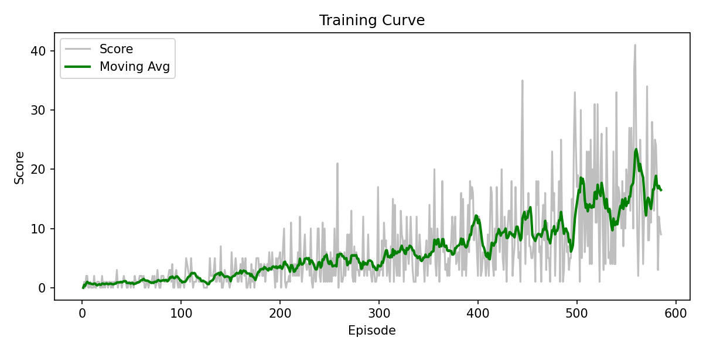

# CDS524 Assignment 1 — Reinforcement Learning Game Design Report

**Student:** WANG Shiyu  
**Game:** AI Snake — Deep Q-Learning (DQN) with Pygame + PyTorch  

## 1. Introduction

This project implements a grid-based Snake game and trains an AI agent using reinforcement learning. The objective of Snake is simple: the snake must eat food to increase its score while avoiding collisions with the walls and with its own body. Even with simple rules, the decision-making problem is non-trivial because the snake’s body creates dynamic obstacles and short-term safe actions can lead to long-term traps.

To solve this, I used Deep Q-Learning (DQN), a neural-network approximation of the Q-learning algorithm. Instead of maintaining a tabular Q-value for every state-action pair (which becomes infeasible for larger state spaces), DQN learns a function $Q(s,a)$ using a neural network and improves its policy through repeated interaction with the environment.

The implementation is written in Python using Pygame for the environment/UI and PyTorch for the DQN model and training pipeline.

## 2. Game Design

### 2.0 Working Diagram (Environment–Agent Loop)

```mermaid
flowchart LR
   A[Snake Environment\n(Pygame)] -->|state s (11D)| B[DQN Agent]
   B -->|action a (left/straight/right)| A
   A -->|reward r, next state s', done| B
   B -->|store transition| M[Replay Buffer]
   M -->|mini-batch| T[Train Step\n(MSE loss)]
   T -->|update weights| B
```

### 2.1 Objective and Rules

- The game runs on a **20×20 grid**.
- The snake starts at the center with length 3 and an initial direction to the right.
- At each time step, the agent chooses one of three relative actions: **turn left**, **go straight**, or **turn right**.
- The snake dies if it collides with the boundary or with its own body.
- The score increases when food is eaten.

This creates a clear objective (maximize score/survival) and a well-defined transition system suitable for reinforcement learning.

### 2.2 State Space

The agent receives an **11-dimensional binary feature vector** representing (i) immediate collision risk, (ii) food direction relative to the head, and (iii) the current movement direction.

**Table 1: Definition of the 11D state vector (binary features)**

| Dim | Name | Meaning | Values |
|---:|---|---|---|
| 0 | Danger Straight | Obstacle immediately in front of the head (wall or body) | 1=danger, 0=safe |
| 1 | Danger Right | Obstacle immediately to the right of the head | 1=danger, 0=safe |
| 2 | Danger Left | Obstacle immediately to the left of the head | 1=danger, 0=safe |
| 3 | Food Left | Food is to the left of the head | 1=yes, 0=no |
| 4 | Food Right | Food is to the right of the head | 1=yes, 0=no |
| 5 | Food Up | Food is above the head | 1=yes, 0=no |
| 6 | Food Down | Food is below the head | 1=yes, 0=no |
| 7 | Move Left | Current movement direction is left | 1=yes, 0=no |
| 8 | Move Right | Current movement direction is right | 1=yes, 0=no |
| 9 | Move Up | Current movement direction is up | 1=yes, 0=no |
| 10 | Move Down | Current movement direction is down | 1=yes, 0=no |

Note: “left/right/up/down” are defined in screen coordinates relative to the head position.

This compact representation avoids the huge raw-grid state space, while still preserving key information needed for safe navigation and food seeking.

### 2.3 Action Space

The action space contains 3 actions:

- 0: turn left
- 1: go straight
- 2: turn right

Using relative actions prevents invalid 180° turns and keeps the policy space simple.

### 2.4 Reward Function

A reward function provides signals to encourage good behavior:

- **Eat food**: +10 (plus optional bonuses for special food types)
- **Death**: −10
- **Alive per step**: +0.1
- **Moving away from food (shaping)**: −0.5 (optional shaping to encourage efficient paths)

This mixture of positive and negative feedback aligns with the game objective and supports learning without requiring human-crafted demonstrations.

**Reward design iteration.** A sparse reward (food/death only) makes exploration inefficient because useful trajectories are rare early on. A small living reward (+0.1) encourages movement and discovery of useful transitions. To reduce unnecessary wandering, a light shaping penalty (−0.5) is applied when the snake moves away from the food. Special food types (bonus/poison) enrich the learning signal while keeping the core objective unchanged.

## 3. Q-Learning / DQN Implementation

### 3.1 Algorithm

Classical Q-learning updates a table via:

$$Q(s,a) \leftarrow Q(s,a) + \alpha \left[r + \gamma \max_{a'} Q(s',a') - Q(s,a)\right]$$

In this project, I use DQN (deep Q-learning) where $Q(s,a)$ is approximated by a neural network. The learning target is:

$$y = r + (1 - done) \gamma \max_{a'} Q(s',a')$$

and the model is trained to minimize mean squared error between predicted Q-values and the target.

### 3.2 Neural Network

The network `LinearQNet` is a 4-layer fully connected network:

- Input: 11
- Hidden: 256 → 128 → 64 with ReLU
- Output: 3 (Q-values for each action)

**Design rationale.** The network maps the compact 11D state to 3 action values. ReLU activations introduce non-linearity needed for value approximation. The decreasing hidden widths (256→128→64) progressively compress features into higher-level abstractions while controlling model capacity, which is a stable baseline for small structured state spaces.

### 3.3 Exploration vs Exploitation

The agent uses an **epsilon-greedy** policy:

- Start epsilon: 0.8
- Minimum epsilon: 0.01
- Multiplicative decay per episode

This balances exploration early in training with exploitation later.

### 3.4 Replay Buffer and Optimization

A replay buffer stores transitions $(s, a, r, s', done)$ with:

- Capacity: 10,000
- Batch size: 32

Sampling random minibatches reduces correlation between samples and stabilizes training.

Training uses:

- Optimizer: Adam
- Learning rate: 0.001
- Discount factor: $\gamma = 0.95$

The script saves the trained network weights to `model.pth`.

### 3.5 Hyperparameters (as implemented)

- Replay buffer size: 10,000
- Batch size: 32
- Learning rate: 0.001 (Adam)
- Discount factor: 0.95
- Epsilon: start 0.8 → min 0.01 with multiplicative decay
- Episodes: 300 in training mode

These were chosen to keep the training stable and fast enough to demonstrate progress within the assignment time constraints.

## 4. Game Interaction and UI

The game provides a real-time UI that supports both human play and AI play.

Key interaction features:

- Mode switching: manual / random AI / training / test
- On-screen panel showing:
  - score, best score
  - current mode and speed
  - epsilon (when relevant)
  - last action and last reward
  - the 11D state vector
- Game over screen with restart prompt

These elements satisfy the requirement that the UI displays state, actions, and rewards/penalties.

## 5. Evaluation Results

During training mode, the game records the score per episode and produces a plot (`training_curve.png`) with a moving average.



Because the policy is trained under ε-greedy exploration, early episodes are noisy. As ε decays, the agent becomes more consistent.

Typical observations include:

- Early episodes: low scores with frequent wall/self collisions during exploration.
- Mid training: gradual improvement as the agent learns basic obstacle avoidance and food-seeking behavior.
- Late training: higher moving-average score and fewer immediate collisions as ε approaches its minimum.

The `test` mode loads `model.pth` and runs the trained policy with $\epsilon=0$ to demonstrate pure exploitation.

## 6. Challenges and Solutions

1. **Training speed vs visualization**
   - Challenge: rendering every frame slows training.
   - Solution: training runs without delay, and visualization updates only every 50 episodes (or disabled in headless mode).

2. **Reward shaping trade-offs**
   - Attempt 1: sparse reward (+food, −death) was simple but made exploration slow.
   - Attempt 2: add a small living reward (+0.1) to encourage movement.
   - Attempt 3: stronger directional shaping can bias behavior (e.g., oscillation near food), so shaping was kept lightweight.
   - Final: keep the main signal simple (+food/−death) and use minimal shaping (penalize moving away only).

3. **Colab / headless execution**
   - Challenge: Pygame windows and audio may fail in notebook environments.
   - Solution: a `HEADLESS=1` option disables audio and training screenshots to allow training runs in non-GUI environments.

4. **Gameplay and presentation polish**
   - Challenge: a plain grid UI is hard to watch in a demo.
   - Solution: improved UI readability (mode badge, info card) and user experience (manual start gate, speed levels, restart prompt).

## 7. Conclusion and Future Work

This project demonstrates how (deep) Q-learning can be applied to a game environment with a clear objective, well-defined state/action spaces, and a reward function. The agent learns through trial and error using epsilon-greedy exploration and experience replay, and the results can be evaluated through training curves and test-time gameplay.

Future improvements could include a target network, double DQN, or richer state representations (e.g., additional body/obstacle features) to further stabilize and improve learning.

## References

- Mnih, V. et al. (2015). *Human-level control through deep reinforcement learning*. Nature.
- Sutton, R. S., & Barto, A. G. (2018). *Reinforcement Learning: An Introduction* (2nd ed.).
- PyTorch Documentation: https://pytorch.org/docs/
- Pygame Documentation: https://www.pygame.org/docs/

## Demo Video Checklist (3–5 minutes)

- Show manual gameplay briefly
- Switch to training and show fast progress (mention epsilon decay)
- Show the training curve plot
- Switch to test mode and demonstrate AI playing
- Explain 2–3 key challenges and fixes
